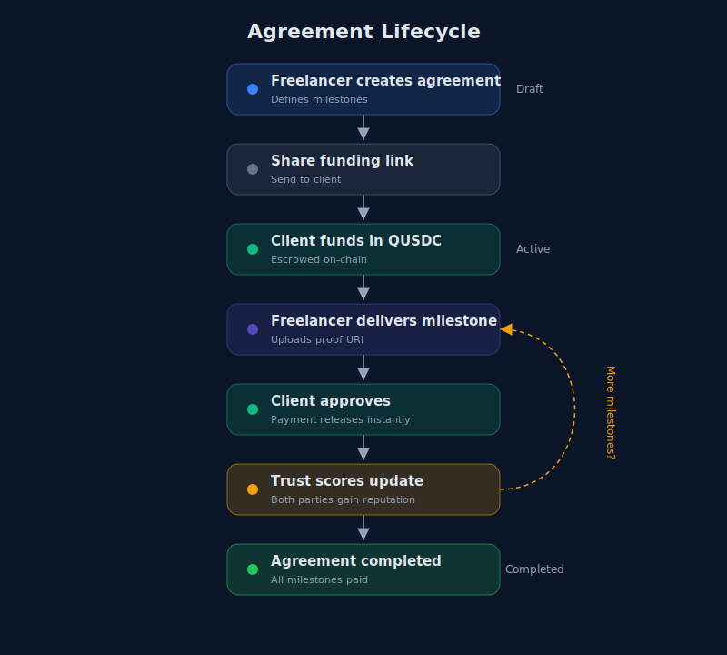
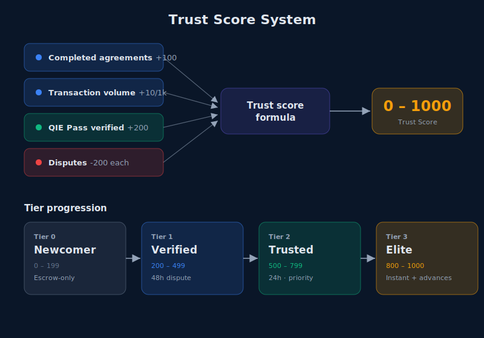
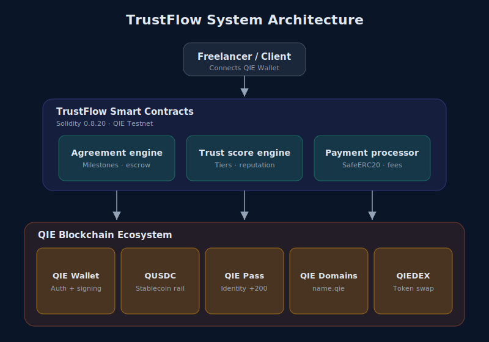

<div align="center">

# TrustFlow

### Payments that build credit. Built on QIE.

[](https://trustflow-qie.vercel.app)
[](https://www.qie.digital)
[](#smart-contracts)
[](LICENSE)

[Live Demo](https://trustflow-qie.vercel.app) · [Documentation](https://trustflow-qie.vercel.app/docs) · [Solo Demo](https://trustflow-qie.vercel.app/demo)

</div>

---

## Overview

TrustFlow is a PayFi protocol on QIE Blockchain where every completed payment builds your on-chain credit history. Freelancers and clients create milestone-based payment agreements using QUSDC stablecoin. Each completed agreement updates both parties' Trust Score, which unlocks progressively better financial terms enforced directly by the smart contract.

Live on QIE Mainnet and Testnet. Switch networks from the header: mainnet uses real QUSDC, testnet uses a faucet and a hosted solo demo for safe experimentation.

## The Problem

Web3 payments are zero-trust and zero-context. There is no way to build a credit history, earn better terms, or prove you are a reliable counterparty. This forces 150%+ overcollateralization on DeFi loans and excludes 1.4 billion unbanked adults from credit entirely. The root cause: blockchain anonymity makes it impossible to link identity with financial track record.

## The Solution

TrustFlow creates a feedback loop between payments and reputation:

1. Create a milestone payment agreement with on-chain escrow
2. Complete milestones, provide proof, get paid
3. Both parties earn Trust Score points from the completed agreement
4. Higher Trust Score unlocks better on-chain terms next time
5. Repeat: your payment history becomes your credit history



## Key Innovation: Trust Enforced On-Chain

The Trust Score is not cosmetic. It enforces real financial terms at the smart contract level. Higher-tier users get tangible benefits that lower-tier users cannot access, regardless of what the frontend shows.



| Tier | Name | Score | Enforced Terms |
|------|------|-------|----------------|
| 0 | Newcomer | 0-199 | Full escrow. Funds locked until each milestone approved. |
| 1 | Verified | 200-499 | Full escrow with 48h auto-refund protection. |
| 2 | Trusted | 500-799 | 25% of each milestone released upfront on funding. |
| 3 | Elite | 800-1000 | Auto-claim: get paid 24h after delivery if client stays silent. |

**Trust Score inputs:**

| Input | Effect |
|-------|--------|
| Completed agreements | +100 per agreement |
| Transaction volume | +10 per $1,000 QUSDC |
| QIE Pass verified | +200 bonus |
| Disputes | -200 penalty each |

## Architecture

TrustFlow has three layers:

- **Frontend**: Next.js 14 dApp with wagmi v2, viem, RainbowKit, and Framer Motion animations
- **Smart Contracts**: Solidity 0.8.20 on QIE Mainnet and Testnet. Tier-enforced escrow, trust score engine, and payment processor with SafeERC20 and ReentrancyGuard
- **QIE Ecosystem**: Deep integration with all five core QIE components



## QIE Ecosystem Integration

TrustFlow is the only protocol integrating all five core QIE components:

| Component | How TrustFlow Uses It |
|-----------|----------------------|
| **QIE Wallet** | Primary authentication and transaction signing via EIP-6963 |
| **QUSDC** | All payments settled in QIE's native stablecoin (6 decimals) |
| **QIE Pass** | Identity verification. Verified users get +200 trust score bonus |
| **QIE Domains** | Human-readable payment addresses (pay to name.qie) |
| **QIEDEX** | Live QIE price quotes read from the QIEDEX router on mainnet |

## Features

**Core Protocol**
- Milestone-based payment agreements with on-chain escrow
- On-chain Trust Score computed from real transaction history
- Four trust tiers with real, enforced terms (not cosmetic labels)
- Tier 2: 25% upfront release on funding
- Tier 3: 24h auto-claim after delivery with client dispute window
- Two-step funding flow (QUSDC approve + deposit)
- Shareable funding links for clients
- Public trust profiles with tier badges

**Cold-Visitor Onboarding**
- In-app QUSDC faucet (one-click mint, no external site needed)
- One-click "Add Network" button (adds the active QIE network)
- Header network switcher (mainnet and testnet) with EIP-6963 wallet chain sync
- Guided getting-started checklist at /start
- Solo demo mode at /demo (automated client funds and approves for you)
- One-click QUSDC token import to wallet (EIP-6963 aware)

**Analytics and Social**
- Protocol-wide analytics dashboard (total volume, active agreements, average scores)
- Trust leaderboard with tier breakdown
- Per-address trust profiles with agreement history

**Technical**
- OpenZeppelin security (ReentrancyGuard, SafeERC20, Ownable)
- 106 unit tests passing (including tier enforcement tests)
- 0.5% platform fee on milestone payments
- Full event logging for on-chain receipts
- Server-side relayer for solo demo (narrow scope, rate limited)

## Try It Yourself

The app defaults to QIE Mainnet. Switch to testnet from the header dropdown for safe experimentation with a faucet and the hosted solo demo.

**On mainnet (production):**
1. **Visit** [trustflow-qie.vercel.app](https://trustflow-qie.vercel.app) and connect your wallet
2. **Add QIE Mainnet**: click the "Add QIE Mainnet" button (one click)
3. **Get gas**: buy QIE on an exchange or bridge in at [bridge.qie.digital](https://bridge.qie.digital/)
4. **Get QUSDC**: bridge USDC to QUSDC at [bridge.qie.digital](https://bridge.qie.digital/)
5. **Create your first agreement**: set up a milestone payment and start building credit

**On testnet (free experimentation):**
1. Switch to QIE Testnet in the header
2. Get testnet QIE from the [QIE faucet](https://www.qie.digital/faucet)
3. Mint test QUSDC with the in-app faucet button
4. Run the [solo demo](https://trustflow-qie.vercel.app/demo) for a guided full cycle

Or visit [/start](https://trustflow-qie.vercel.app/start) for the interactive getting-started checklist, which adapts to the active network.

<details>
<summary><strong>Manual network config (if one-click add doesn't work)</strong></summary>

```
QIE Mainnet
RPC: https://rpc1mainnet.qie.digital/
Chain ID: 1990
Currency: QIE
Explorer: https://mainnet.qie.digital/
QUSDC Token: 0x3F43DA82eC9A4f5285F10FaF1F26EcA7319E5DA5

QIE Testnet
RPC: https://rpc1testnet.qie.digital/
Chain ID: 1983
Currency: QIE
Explorer: https://testnet.qie.digital/
QUSDC Token: 0x1850d2a31CB8669Ba757159B638DE19Af532ba5e
```

</details>

## Smart Contracts

| Contract | Network | Address | Explorer |
|----------|---------|---------|----------|
| TrustFlow | Mainnet | `0xB9F38E0180F62e80Be6ca44cE6202316FCcefEC9` | [View](https://mainnet.qie.digital/address/0xB9F38E0180F62e80Be6ca44cE6202316FCcefEC9) |
| QUSDC | Mainnet | `0x3F43DA82eC9A4f5285F10FaF1F26EcA7319E5DA5` | [View](https://mainnet.qie.digital/address/0x3F43DA82eC9A4f5285F10FaF1F26EcA7319E5DA5) |
| TrustFlow | Testnet | `0xcD0915cb3423F6665C636d723648F78d88B81e52` | [View](https://testnet.qie.digital/address/0xcD0915cb3423F6665C636d723648F78d88B81e52) |
| MockQUSDC | Testnet | `0x1850d2a31CB8669Ba757159B638DE19Af532ba5e` | [View](https://testnet.qie.digital/address/0x1850d2a31CB8669Ba757159B638DE19Af532ba5e) |

**Key contract functions:**
- `createAgreement()` : Create a milestone payment agreement
- `fundAgreement()` : Client deposits QUSDC into escrow (Tier 2: 25% upfront)
- `completeMilestone()` : Freelancer marks done with proof (Tier 3: starts 24h claim window)
- `approveMilestone()` : Client approves, payment releases instantly
- `claimMilestone()` : Tier 3 creator auto-claims after 24h window
- `disputeMilestone()` : Client blocks auto-claim inside the window
- `getTrustProfile()` : Read any address's trust score and tier
- `getEnforcedTerms()` : Read what on-chain terms apply to a given tier

Built with Solidity 0.8.20, OpenZeppelin, ReentrancyGuard, SafeERC20. **106 tests passing.**

## Tech Stack

| Layer | Technology |
|-------|-----------|
| Frontend | Next.js 14, TypeScript, Tailwind CSS v3 |
| Animations | Framer Motion |
| Web3 | wagmi v2, viem, RainbowKit (EIP-6963 multi-wallet) |
| Smart Contracts | Solidity 0.8.20, Hardhat, OpenZeppelin |
| Blockchain | QIE Mainnet (1990) and Testnet (1983) |
| Stablecoin | QUSDC (6 decimals) |
| Fonts | Space Grotesk, Manrope, JetBrains Mono |
| Deployment | Vercel (frontend), QIE Mainnet and Testnet (contracts) |

## Local Development

```bash
# Clone
git clone https://github.com/Vinaystwt/TrustFlow.git
cd TrustFlow

# Smart contracts
cd trustflow
npm install
npx hardhat compile
npx hardhat test          # 106 tests

# Frontend
cd ../frontend
npm install
cp .env.example .env.local  # add your env vars
npm run dev                  # http://localhost:3000
```

**Prerequisites:** Node.js 18+, MetaMask or QIE Wallet configured for QIE Mainnet or Testnet.

## How It Is Built

- **Next.js 14 App Router** with server components for static pages and client components for wallet interactions
- **wagmi v2 + viem** for type-safe contract reads/writes. No ethers.js on the frontend.
- **EIP-6963 multi-wallet support** via RainbowKit `getDefaultConfig`. Each installed wallet gets its own named entry in the connect modal.
- **Server-side relayer** powers the solo demo. A Next.js API route signs fund/approve transactions so users can try the full cycle without a second wallet. Narrow scope (fund + approve only), rate limited (3 actions/hour), explicit gas limits, receipt verification.
- **On-chain event indexing** for leaderboard and analytics. Contract events are read client-side and aggregated for protocol stats.
- **Framer Motion** for page transitions, staggered card reveals, and micro-interactions. No bounce or elastic easing.

## Roadmap

TrustFlow is built to last. The full roadmap is on the [docs page](https://trustflow-qie.vercel.app/docs#roadmap).

| Quarter | Theme | Highlights |
|---------|-------|------------|
| **Q3 2026** | Production Readiness | Security audit, QIE mainnet deployment, live QIE Pass + Domains integration |
| **Q4 2026** | Protocol Depth | Under-collateralized lending, streaming payments, staked arbitration |
| **Q1 2027** | Ecosystem Expansion | Public SDK/API, embeddable widget, composable reputation, PWA |
| **Q2 2027** | Scale and Sustainability | Cross-chain portability, fiat on/off ramps, DAO governance |

## Built By

Vinay ([@vinaystwt](https://twitter.com/vinaystwt))

Built for the QIE Blockchain Hackathon 2026.

---

<div align="center">

**Your payment history is your credit history. Built on QIE.**

</div>
